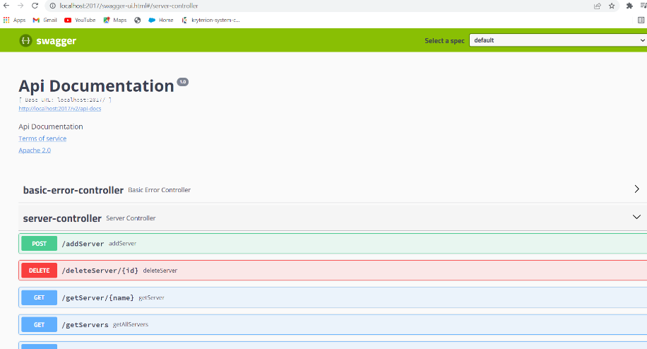

------------------------Task 2: Swagger Codegen Implementation-------------------------

------------Integrating Swagger with Spring Boot and MongoDB---------------

In this task, we integrated Swagger into the existing project from Task 1. Here are the steps we followed:

Added Swagger Dependencies: We added the necessary dependencies for Swagger into the existing project.

Created SwaggerConfig.java: A new Java file named SwaggerConfig.java was created, and the class was annotated with @EnableSwagger2 to enable Swagger in the Spring Boot application.

Testing Swagger Locally: We tested Swagger on the local server using the URL http://127.0.0.1:2017/swagger-ui.html#. This provided us with a user-friendly UI for interacting with the API.

Performing API Actions: We used the Swagger UI to perform various API actions, including adding a server.

Code Export: We exported the code generated from Swagger UI and tested it on an online editor.
By integrating Swagger, we provided an interactive API documentation and testing interface for the Spring Boot and MongoDB project, making it easier to develop, test, and document the APIs.

                                  -------------Thank you!---------------

